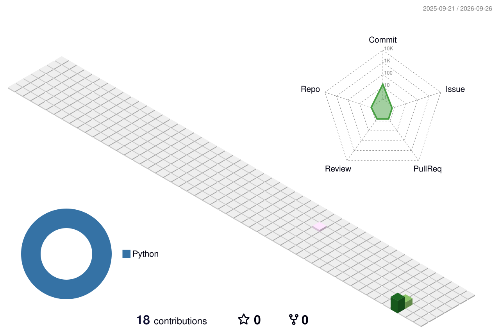

<!-- Dynamic assets below are generated and committed by GitHub Actions. -->

<picture>
  <source media="(prefers-color-scheme: dark)" srcset="./assets/generated/hero.dark.svg">
  <source media="(prefers-color-scheme: light)" srcset="./assets/generated/hero.light.svg">
  
</picture>

<div align="center">

### Full‑Stack Engineer · Product Engineering · Cloud · DevOps · Mobile · AI

**Building production-grade digital products at [SKOLEOM PLATFORM INC.](https://skoleom.com/)**

<br />

[](https://github.com/jeremyznn)
[](https://skoleom.com/)
[](https://github.com/jeremyznn?tab=repositories)
[](https://discord.com/users/461604848924753921)

</div>

<br />

## 01 · Engineering profile

<table>
<tr>
<td width="50%" valign="top">

### Product engineering

Je transforme un besoin produit en interface exploitable, architecture maintenable et fonctionnalité réellement prête pour la production.

`React` `Next.js` `TypeScript` `Tailwind CSS` `UI/UX`

</td>
<td width="50%" valign="top">

### Backend & integrations

API, authentification, logique métier, paiements, webhooks et intégrations de services externes connectés aux données.

`Node.js` `Prisma` `REST` `OAuth 2.0` `Stripe`

</td>
</tr>
<tr>
<td width="50%" valign="top">

### Cloud & reliability

Déploiement, conteneurisation, orchestration, reverse proxy, CI/CD et exploitation de services Linux en production.

`AWS` `Docker` `Kubernetes` `K3s` `Cloudflare` `GitHub Actions`

</td>
<td width="50%" valign="top">

### Mobile & AI

Applications mobiles, notifications, services Firebase et intégration de modèles IA/LLM dans des workflows produit.

`Flutter` `Firebase` `LLM APIs` `Automation` `Wallet APIs`

</td>
</tr>
</table>

<br />

## 02 · SKOLEOM PLATFORM INC.

<table>
<tr>
<td width="62%" valign="top">

Je travaille sur des produits et systèmes numériques au sein de **SKOLEOM PLATFORM INC.**, dans un environnement orienté **software engineering, commerce interactif, Retail Media et Transmedia**.

L’écosystème public de Skoleom relie technologie propriétaire, expériences audiovisuelles interactives, applications web, billetterie et intégrations commerciales.

**Mon périmètre technique :** interfaces produit, fonctionnalités full‑stack, API et intégrations, mobile, cloud, automatisation et fiabilité en production.

</td>
<td width="38%" valign="top">

**Company**

`SKOLEOM PLATFORM INC.`

**Industry**

`Software · Interactive Commerce`

**Engineering**

`Web · Mobile · Cloud · APIs`

**Location**

`Paris · France`

</td>
</tr>
</table>

<p align="center">
  <a href="https://skoleom.com/"><b>Explore the Skoleom ecosystem →</b></a>
</p>

<br />

## 03 · Capability map

<picture>
  <source media="(prefers-color-scheme: dark)" srcset="./assets/generated/stack.dark.svg">
  <source media="(prefers-color-scheme: light)" srcset="./assets/generated/stack.light.svg">
  
</picture>

<br />

<details>
<summary><b>Full technical stack</b></summary>

<br />

| Area | Technologies |
| --- | --- |
| **Frontend** | React · Next.js · TypeScript · JavaScript · HTML · CSS · Tailwind CSS · Radix UI · Responsive UI · Accessibility |
| **Backend** | Node.js · REST APIs · Authentication · OAuth 2.0 · Webhooks · Business logic |
| **Data** | Prisma · MySQL · MariaDB · MongoDB |
| **Mobile** | Flutter · Firebase · Push notifications |
| **Cloud** | AWS EC2 · S3 · RDS · Lambda · Cloudflare · Vercel |
| **Infrastructure** | Docker · Docker Compose · Kubernetes · K3s · Linux · Debian · Traefik · Apache |
| **DevOps** | GitHub Actions · CI/CD · Git · Bash · SSH · Monitoring |
| **Integrations** | Stripe · Discord.js · Apple Wallet · Google Wallet · Amazon APIs · WooCommerce |
| **AI** | LLM APIs · Generative AI integrations · Product automation |

</details>

<br />

## 04 · GitHub // live telemetry

<picture>
  <source media="(prefers-color-scheme: dark)" srcset="./assets/cards/overview.dark.svg">
  <source media="(prefers-color-scheme: light)" srcset="./assets/cards/overview.light.svg">
  
</picture>

<br />

<picture>
  <source media="(prefers-color-scheme: dark)" srcset="./assets/cards/contributions.dark.svg">
  <source media="(prefers-color-scheme: light)" srcset="./assets/cards/contributions.light.svg">
  
</picture>

<br />

<table>
<tr>
<td width="50%" valign="top">

<picture>
  <source media="(prefers-color-scheme: dark)" srcset="./assets/cards/rhythm.dark.svg">
  <source media="(prefers-color-scheme: light)" srcset="./assets/cards/rhythm.light.svg">
  
</picture>

</td>
<td width="50%" valign="top">

<picture>
  <source media="(prefers-color-scheme: dark)" srcset="./assets/cards/composition.dark.svg">
  <source media="(prefers-color-scheme: light)" srcset="./assets/cards/composition.light.svg">
  
</picture>

</td>
</tr>
</table>

<sub>Live cards generated from the GitHub GraphQL API and committed back to this repository by GitHub Actions.</sub>

<br /><br />

## 05 · Contribution world // 3D

<picture>
  <source media="(prefers-color-scheme: dark)" srcset="./profile-3d-contrib/profile-night-rainbow.svg">
  
</picture>

<br />

## 06 · Contribution stream

<picture>
  <source media="(prefers-color-scheme: dark)" srcset="./assets/generated/github-snake-dark.svg">
  <source media="(prefers-color-scheme: light)" srcset="./assets/generated/github-snake.svg">
  
</picture>

<br />

## 07 · How I ship

```text
DISCOVER ───── DESIGN ───── BUILD ───── INTEGRATE ───── SHIP ───── OBSERVE ───── ITERATE
   │              │           │             │              │           │             │
 product           UX       full-stack      APIs          cloud      reliability     scale
```

<table>
<tr>
<td width="33%" valign="top">

### Experience

Interfaces cohérentes, responsive, accessibles et pensées pour une utilisation réelle.

</td>
<td width="33%" valign="top">

### Architecture

Composants maintenables, logique métier claire, données structurées et intégrations propres.

</td>
<td width="33%" valign="top">

### Production

CI/CD, conteneurs, orchestration, supervision et environnements conçus pour durer.

</td>
</tr>
</table>

<br />

---

<div align="center">

### Build products that feel simple — even when the systems behind them are not.

**Web · Mobile · Cloud · DevOps · AI**

<sub>Profile assets rebuilt automatically with GitHub Actions.</sub>

</div>
