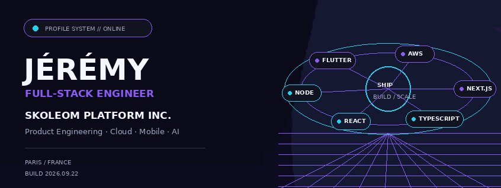
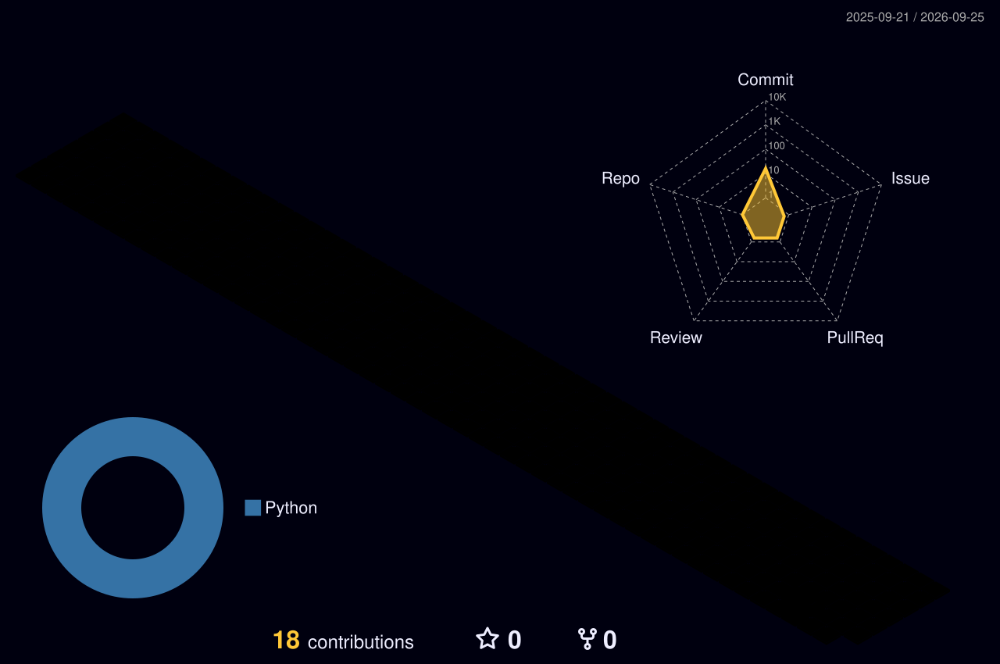
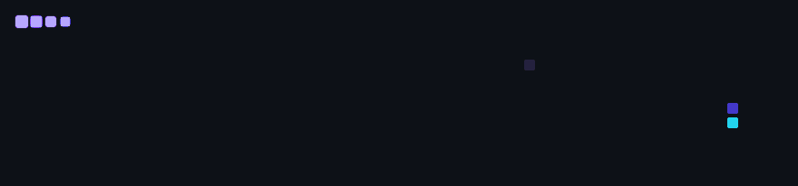

<!--
  Jérémy — GitHub Profile
  GitHub-first layout: single-column, responsive, self-hosted generated assets.
-->

<picture>
  <source media="(prefers-color-scheme: dark)" srcset="./assets/generated/hero.dark.gif">
  <source media="(prefers-color-scheme: light)" srcset="./assets/generated/hero.light.gif">
  
</picture>

<div align="center">

### Full‑Stack Engineer · Product Engineering · Cloud · DevOps · Mobile · AI

Building production-grade digital products at **[SKOLEOM PLATFORM INC.](https://skoleom.com/)**

<br>

[](https://github.com/jeremyznn)
[](https://skoleom.com/)
[](https://github.com/jeremyznn?tab=repositories)

</div>

<br>

## Engineering

Je conçois des produits numériques de bout en bout : expérience utilisateur, composants front-end, logique métier, API, données, intégrations, mobile et infrastructure de production.

### Stack // Visual

<p align="center">
  <picture>
    <source
      media="(prefers-color-scheme: dark)"
      srcset="https://skill-icons-v2.vercel.app/api/icons?i=javascript,typescript,react,nextjs,tailwindcss,nodejs,prisma,mysql,mongodb,flutter,firebase,aws,docker,kubernetes,linux,cloudflare,vercel,githubactions&theme=dark&perline=9"
    >
    <source
      media="(prefers-color-scheme: light)"
      srcset="https://skill-icons-v2.vercel.app/api/icons?i=javascript,typescript,react,nextjs,tailwindcss,nodejs,prisma,mysql,mongodb,flutter,firebase,aws,docker,kubernetes,linux,cloudflare,vercel,githubactions&theme=light&perline=9"
    >
    
  </picture>
</p>

<p align="center">
  <picture>
    <source
      media="(prefers-color-scheme: dark)"
      srcset="https://skill-icons-v2.vercel.app/api/icons?i=git,github,npm,bash,vscode,postman,debian&theme=dark&perline=7"
    >
    <source
      media="(prefers-color-scheme: light)"
      srcset="https://skill-icons-v2.vercel.app/api/icons?i=git,github,npm,bash,vscode,postman,debian&theme=light&perline=7"
    >
    
  </picture>
</p>

<details>
<summary><strong>Voir la stack complète</strong></summary>

<br>

**Product & Frontend**  
`React` `Next.js` `TypeScript` `JavaScript` `Tailwind CSS` `Radix UI` `Responsive UI` `Accessibility`

**Backend & Data**  
`Node.js` `Prisma` `REST APIs` `Authentication` `OAuth 2.0` `Webhooks` `MySQL` `MariaDB` `MongoDB`

**Mobile & Product Services**  
`Flutter` `Firebase` `Push Notifications` `Apple Wallet` `Google Wallet`

**Cloud & Infrastructure**  
`AWS EC2` `AWS S3` `AWS RDS` `AWS Lambda` `Docker` `Kubernetes` `K3s` `Linux` `Debian` `Cloudflare` `Vercel`

**DevOps & Reliability**  
`GitHub Actions` `CI/CD` `Traefik` `Apache` `Bash` `SSH` `Monitoring`

**Integrations & AI**  
`Stripe` `Discord.js` `Amazon APIs` `WooCommerce` `LLM APIs` `Generative AI` `Automation`

</details>

<br>

## SKOLEOM PLATFORM INC.

Je travaille dans l’écosystème **SKOLEOM PLATFORM INC.**, une société technologique française positionnée publiquement autour du **Retail Media**, du **Transmedia** et du commerce interactif intégré aux contenus audiovisuels.

Mon travail se situe à l’intersection du **software engineering**, du produit et de la production : interfaces, fonctionnalités full-stack, API et intégrations, applications mobiles, services cloud et automatisation.

**Focus :** `Web` · `Mobile` · `Cloud` · `APIs` · `Automation` · `Production`

<p align="center">
  <a href="https://skoleom.com/"><strong>skoleom.com →</strong></a>
</p>

<br>

## GitHub // Live

<picture>
  <source media="(prefers-color-scheme: dark)" srcset="./assets/cards/overview.dark.svg">
  <source media="(prefers-color-scheme: light)" srcset="./assets/cards/overview.light.svg">
  
</picture>

<br>

<picture>
  <source media="(prefers-color-scheme: dark)" srcset="./assets/cards/contributions.dark.svg">
  <source media="(prefers-color-scheme: light)" srcset="./assets/cards/contributions.light.svg">
  
</picture>

<br>

<picture>
  <source media="(prefers-color-scheme: dark)" srcset="./assets/cards/languages.dark.svg">
  <source media="(prefers-color-scheme: light)" srcset="./assets/cards/languages.light.svg">
  
</picture>

<sub>Generated from the GitHub GraphQL API and committed into this repository by GitHub Actions.</sub>

<br><br>

## Contribution World // 3D

<picture>
  <source media="(prefers-color-scheme: dark)" srcset="./profile-3d-contrib/profile-night-rainbow.svg">
  <source media="(prefers-color-scheme: light)" srcset="./profile-3d-contrib/profile-season.svg">
  
</picture>

<br>

## Contribution Stream

<picture>
  <source media="(prefers-color-scheme: dark)" srcset="./assets/generated/github-snake-dark.gif">
  <source media="(prefers-color-scheme: light)" srcset="./assets/generated/github-snake-light.gif">
  
</picture>

<br>

## How I build

```text
DISCOVER  →  DESIGN  →  BUILD  →  INTEGRATE  →  SHIP  →  OBSERVE  →  ITERATE
product      UX         code       APIs          cloud     reliability   scale
```

**Experience** — interfaces simples, cohérentes, responsives et accessibles.  
**Architecture** — composants maintenables, données structurées, logique métier claire.  
**Production** — CI/CD, conteneurs, orchestration, monitoring et exploitation Linux.

<br>

---

<div align="center">

### Build products that feel simple — even when the systems behind them are not.

`WEB` · `MOBILE` · `CLOUD` · `DEVOPS` · `AI`

<sub>Profile assets rebuilt automatically with GitHub Actions.</sub>

</div>
